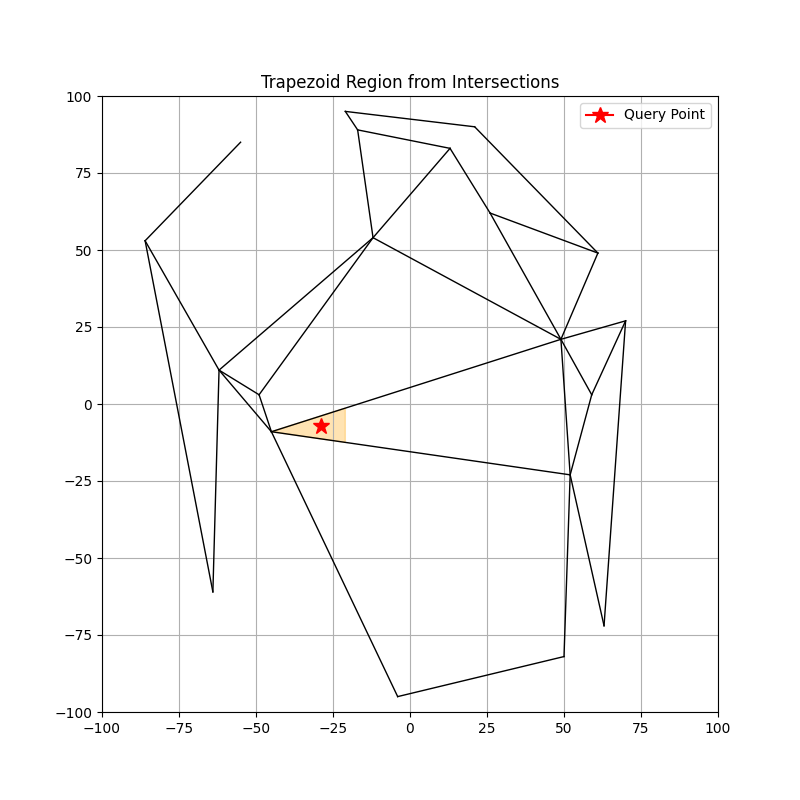

# Point Location using Verctical Decomposition


This program handles a set of line segments and answers queries using **persistent segment trees**. It preprocesses the input in `O(n log n)` time and supports queries in `O(log² n)` time.

---

## How It Works

The core idea is to build a **persistent segment tree** structure that maintains historical versions of segment insertions. This allows us to efficiently:

- Track changes to segment data across multiple versions
- Query segments relevant to a given point using binary search and tree traversal

### Time Complexities

- **Preprocessing**: `O(n log n)`  
  Efficiently builds the persistent structure by inserting each segment in logarithmic time.
  
- **Query**: `O(log² n)`  
  Binary search over versions + segment tree traversal.

---

## Input Format

The input is given via standard input (stdin), in the following format:


### Explanation:

- `n` — the number of segments (an integer)
- The next `n` lines each contain four space-separated integers:
  - `x1 y1` — starting point of the segment
  - `x2 y2` — ending point of the segment
- The last line contains two integers `qx qy` representing the coordinates of the query point.

## Example

**Input:**

3 <br>
0 0 1 1 <br>
1 0 2 1 <br>
2 2 3 3 <br>
1 1


**Explanation:**
- There are 3 segments:
  - Segment 1: from (0,0) to (1,1)
  - Segment 2: from (1,0) to (2,1)
  - Segment 3: from (2,2) to (3,3)
- The query point is (1,1)

##  How to Run

Compile and run the program using a C++ compiler (with C++11 or later):

```bash
g++ -o vd VD.cpp
./vd < input.txt
```

## Test.sh
Run this file to genarate test cases and plot the graph
```bash
./test.sh NUM_POINTS
```
## Output For Test.sh
 

## 📁 Project Structure

### 1. `struct Point`
Represents a 2D point.

| Field  | Type    | Description                |
|--------|---------|-----------------------------|
| `x`    | `double`| x-coordinate |
| `y`    | `double`| y-coordinate |

- **Constructor** initializes coordinates (default (0,0)).

---

### 2. `struct Segment`
Represents a directed segment between two points.

| Field  | Type      | Description                     |
|--------|-----------|---------------------------------|
| `p1`   | `Point`    | Start point |
| `p2`   | `Point`    | End point |
| `id`   | `int`      | Unique ID of segment |

**Important Methods:**
- `bool isAbove(Point p)` — Checks if a point is *above* the segment.
- `double getX(double y)` — Gets x-coordinate of segment at given y.
- `double getY(double x)` — Gets y-coordinate of segment at given x.

---

### 3. `struct Node`
Represents a node in the **segment search tree**.

| Field  | Type    | Description             |
|--------|---------|--------------------------|
| `segment` | `Segment*` | Segment stored at node |
| `timestamp` | `int`  | When the node was created |
| `left` | `PNode*` | Left child |
| `right` | `PNode*` | Right child |

**Constructors:**  
- Create empty node.
- Create node with segment.
- Create node with segment and children.

---

### 4. `struct PNode`
Represents a **Persistent Node**, supporting multiple versions.

| Field | Type | Description |
|-------|------|-------------|
| `nodes` | `vector<pair<int, Node*>>` | Stores node versions sorted by timestamp |

Each version is a `(timestamp, Node*)` pair.

---

### 5. `class PersistentTree`
Persistent search tree over segments, allowing rollback to previous versions.

| Field | Type | Description |
|-------|------|-------------|
| `root` | `PNode*` | Root of the persistent tree |
| `size` | `int` | Size (not used in all methods) |

**Key Methods:**
- `void insert(Segment* seg, int timestamp)`  
  Insert a segment at a given timestamp.
- `void delSegment(Segment* seg, int timestamp)`  
  Delete a segment at a given timestamp.
- `void createVersion(vector<Segment> segments, vector<Segment> del_seg, int ts)`  
  Create new version of tree inserting and deleting batches.
- `Segment* findAbove(int version, Point p)`  
  Find the segment just **above** a point at a given version.
- `Segment* findBelow(int version, Point p)`  
  Find the segment just **below** a point at a given version.

---

### 6. `class PointLocation`
Handles **building the tree** and **querying** points.

| Field | Type | Description |
|-------|------|-------------|
| `tree` | `PersistentTree*` | Underlying persistent tree |
| `start_segments` | `vector<Segment>` | Segments sorted by starting x |
| `end_segments` | `vector<Segment>` | Segments sorted by ending x |
| `sc` | `int` | Index for starting segments |
| `ec` | `int` | Index for ending segments |

**Constructor:**
- Initializes the persistent tree.
- **Sorts** and **removes duplicates**.
- Sweeps through x-coordinates, inserting/removing segments appropriately.

**Key Method:**
- `pair<Segment*, Segment*> locate(const Point& p)`
  - Finds the segment **above and below** a point `p`.
  - First finds the **slab** using `x_coords`.
  - Then queries in the corresponding tree version.

---
