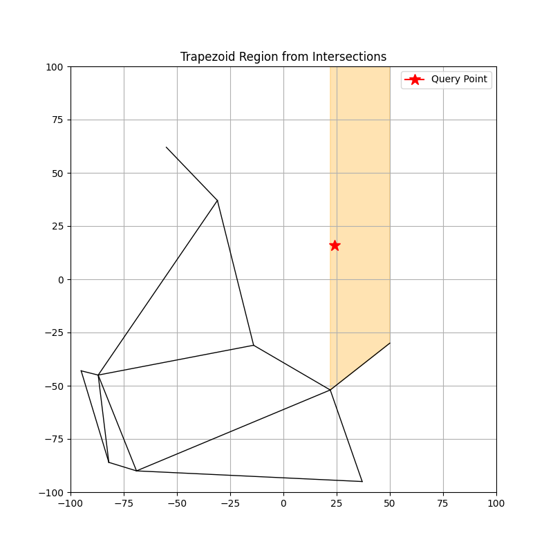

# Trapezoidal Map & Randomized Incremental Construction (RIC)

This project implements a Trapezoidal Map using Randomized Incremental Construction (RIC) for efficient planar point location queries in computational geometry.

## Overview

A **Trapezoidal Map** is a decomposition of the plane into trapezoids using a set of non-intersecting line segments. The **Randomized Incremental Construction (RIC)** technique builds this map by inserting segments in random order, ensuring expected O(n log n) preprocessing time and O(log n) query time.

## Features

- Efficient insertion of segments using Randomized Incremental Construction
- Point location queries with expected O(log n) time complexity
- Robust against degenerate inputs using appropriate geometric primitives

### Time Complexities

- **Preprocessing**: `O(n log n)`  
  
- **Query**: `O(log n)`  

## Input Format

The input is given via standard input (stdin), in the following format:


### Explanation:

- `n` — the number of segments (an integer)
- The next `n` lines each contain four space-separated integers:
  - `x1 y1` — starting point of the segment
  - `x2 y2` — ending point of the segment
- The last line contains two integers `qx qy` representing the coordinates of the query point.

## Example

**Input:**

3 <br>
0 0 1 1 <br>
1 0 2 1 <br>
2 2 3 3 <br>
1 1

**Explanation:**
- There are 3 segments:
  - Segment 1: from (0,0) to (1,1)
  - Segment 2: from (1,0) to (2,1)
  - Segment 3: from (2,2) to (3,3)
- The query point is (1,1)

##  How to Run

Compile and run the program using a C++ compiler 

```bash
make clean
make
./trapmap
```

## Test.sh
Run this file to genarate test cases and plot the graph
```bash
./test.sh NUM_POINTS
```
## Output For Test.sh
 


## 📁 Project Structure

### 1. `struct Point`
Represents a 2D point.

| Field | Type | Description |
|------|------|-------------|
| `x` | `float` | x-coordinate |
| `y` | `float` | y-coordinate |

**Constructor:**
- Initializes a point at given coordinates.

---

### 2. `struct Segment`
Represents a line segment between two points.

| Field | Type | Description |
|------|------|-------------|
| `ptLeft` | `Point` | Left endpoint |
| `ptRight` | `Point` | Right endpoint |

**Key Methods:**
- `isAbove(pTarget, pGuide)` — Determines if a point lies above the segment.
- `ptWithX(x)` — Computes the y-coordinate at a given x along the segment.
- `minY()`, `maxY()` — Returns minimum and maximum y-coordinates of the segment.

**Notes:**
- Segments are **automatically oriented** from left to right based on x-coordinates.

---

### 3. `struct Trapezoid`
Represents a **trapezoidal region** between segments.

| Field | Type | Description |
|------|------|-------------|
| `top`, `bot` | `Segment*` | Top and bottom bounding segments |
| `left`, `right` | `Point` | Left and right x-boundaries |
| `trLeftTop`, `trLeftBot`, `trRightTop`, `trRightBot` | `Trapezoid*` | Neighbor trapezoids |
| `graphNode` | `GraphNode*` | Corresponding node in the DAG |

**Key Methods:**
- `setOneRight(tp)`, `setOneLeft(tp)` — Set only one neighbor on left/right side.
- `changeLeftWith(tp)`, `changeRightWith(tp)` — Update left/right neighbors.

---

### 4. `class GraphNode`
Base class for nodes in the DAG.

| Field | Type | Description |
|------|------|-------------|
| `_left`, `_right` | `GraphNode*` | Child nodes |
| `_parents` | `vector<GraphNode*>` | Parent nodes |

**Key Methods:**
- `nextNode(Point p, Point pExtra)` — Traverse DAG based on point.
- `replaceWith(GraphNode* node)` — Replace this node with another node.

---

### 5. `class XNode : public GraphNode`
Node representing a **vertical split** at an x-coordinate.

| Field | Type | Description |
|------|------|-------------|
| `_point` | `float` | x-coordinate |

**Key Methods:**
- `nextNode(p, _)` — Goes left if p.x < `_point`, otherwise right.

---

### 6. `class YNode : public GraphNode`
Node representing a **segment split**.

| Field | Type | Description |
|------|------|-------------|
| `_segment` | `Segment*` | Segment associated with this node |

**Key Methods:**
- `nextNode(pTarget, pGuide)` — Decides above/below the segment.

---

### 7. `class TerminalNode : public GraphNode`
Represents a **leaf node** pointing to a trapezoid.

| Field | Type | Description |
|------|------|-------------|
| `_trapezoid` | `Trapezoid*` | Associated trapezoid |

**Key Methods:**
- `getTrapezoid()` — Returns the associated trapezoid.

---

### 8. `class TrapezoidMap`
Main class managing the trapezoidal map.

| Field | Type | Description |
|------|------|-------------|
| `_rootNode` | `GraphNode*` | Root of the DAG |
| `_segments` | `vector<Segment>` | List of all inserted segments |

**Key Methods:**
- `addSegment(Segment* segment)` — Adds a segment to the map, updating the trapezoidal decomposition.
- `mapQuery(Point pTarget, Point pExtra)` — Finds the DAG node (trapezoid) containing a point.
- `localize(Point pt)` — Locates trapezoid containing a point.
- `Case1(GraphNode* tpNode, Segment* segment)` — Handles case when segment lies inside a trapezoid without intersections.
- `Case2(GraphNode* pLeft, GraphNode* pRight, Segment* segment)` — Handles segment passing through multiple trapezoids.
- `buildMap(vector<Segment>& segments)` — Build the full trapezoidal map from a list of segments.

---
